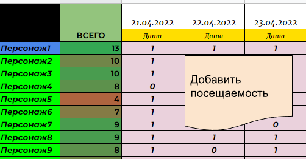

#### attendance-records
Google script (JavaScript) to modify google table docs

> This script is designed to account for the attendance of some persons.
> Input data is list of names(nicknames). Script will set 1 or 0 opposite the names in the corresponding cells.

> Скрипт помогает отмечать посещаемость некоторых людей в Google таблице.
> На вход подается список имен (не обязательно до конца прописанных). Как итог - скрипт заполняет 0 или 1 в зависимости от наличия в списке каждого имени.

#### Table format

